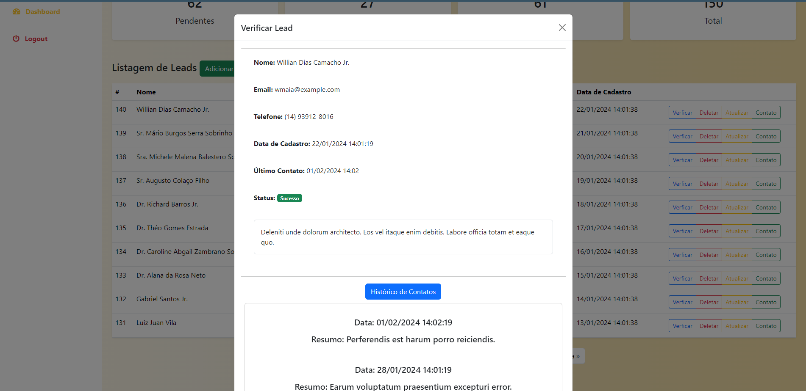
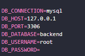

<h1>Gerenciador de Leads</h1>

 

<h2>Passos para usar o projeto:</h2>

<ul>
    <li>Instalar o php da versão 8.1 em diante e instalar o Composer;</li>
    <li>Utilizar o Mysql como banco de dados</li>
</ul>

<h5>Caso queira agilizar este processo, baixe o wampserver, xampp ou laragon e atualize a versão do PHP</h5>

<h2>Configurando o projeto</h2>

<ul>
    <li>1 - Clone o repositório</li>
    <li>2 - Acesse o diretorio do repositório via terminal</li>
    <li>3 - Digite o comando "composer install"</li>
    <li>Renomear o arquivo ".env.example" para apenas ".env"</li>
    <li>Criar um banco de dados chamado backend ou o nome que preferir</li>
    <li>Informar as crendenciais de acesso ao banco de dados no arquivo ".env"</li>
</ul>

 

<ul>
    <li>Acessar o terminal novamente e executar o comando "php artisan migrate" e depois o comando "php artisan db:seed"</li>
    <li>Ainda no terminal, vamos inciar o servidor php. Execute o comando "php artisan serve"</li>
    <li>Por padrão, ele irá rodar o servidor na porta 8000</li>
    <li>link para acessar o projeto: http://localhost:8000/</li>
</ul>

Dentro do projeto Laravel já existem semeadores para o banco de dados para o melhor entendimento do sistema

Usuário para acesso ao sistema:

<b>EMAIL:</b>exemplo@exemplo.com.br

<b>SENHA:</b>1234

<ul>

</ul>
